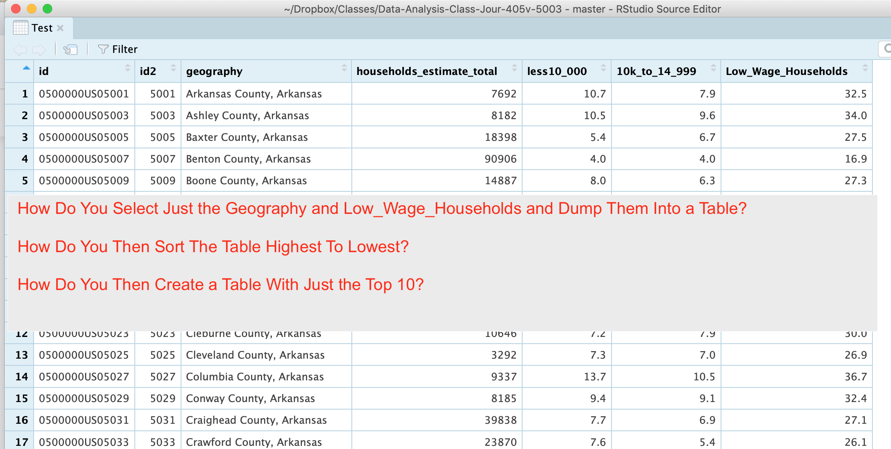
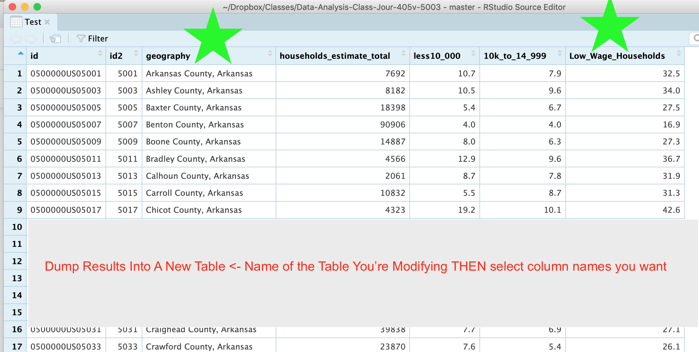
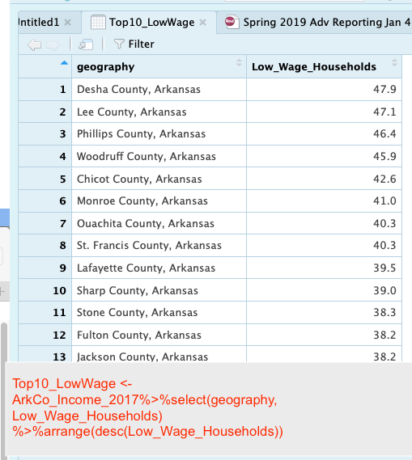
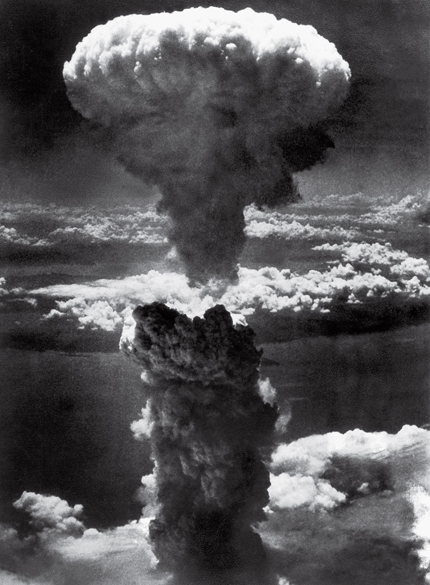

## Filtering and Sorting in Dplyr   

## How to Get The Stuff You Want?

## Dplyr To The Rescue

## How Dplyr Works

## Filter That Bad Boy

##Key Points
- The %>% Pipe Command is a THEN statement
- Dplyr sorts, filter, mutates all in one
- Dplyr is the bomb

