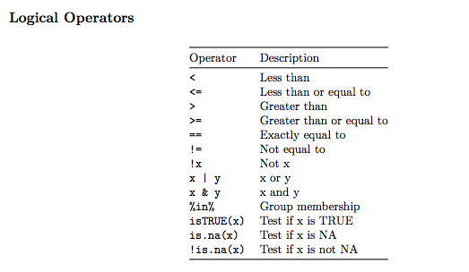
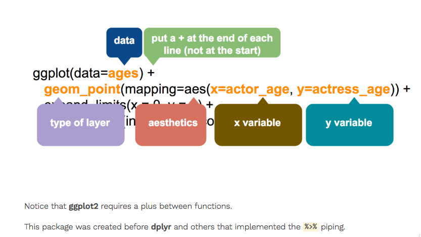

12/21/2018

Inside Twitter: Data Analysis for Journalists
=============================================

Jour 405v, Jour 5003, Spring 2019
---------------------------------


### Rob Wells, Ph.D.

#### University of Arkansas

#### School of Journalism and Strategic Media

> <rswells@uark.edu>

> @rwells1961


**Course Goal:** Students will learn the latest data journalism techniques that drive modern newsrooms and public relations / advertising offices. The class will extract and analyze Twitter data with the goal of producing an interactive multimedia presentation.

**Course Description:** This course will teach students how to code in programs such as R and SQL and how these powerful tools are used in modern news reporting. Quality reporting in newsrooms requires a solid foundation of data analysis. The data skills taught in this class are in high demand in newsrooms and corporations.

**Required Text:** Machlis, Sharon. Practical R for Mass Communications and Journalism. Chapman & Hall/CRC The R Series. 2018. ISBN 9781138726918 <https://www.amazon.com/gp/search?keywords=9781138726918>

> <a href="http://www.machlis.com/R4Journalists/" target="_blank">Link to several free chapters: &quot;CNTL&quot; + click for a New Tab</a>

> <a href="https://docs.google.com/document/d/1O4o5V_GomJPa6ojLeE48y9LhKhmbzTsWu9jskcZKkbY/edit" target="_blank"><strong>Syllabus - Jour 405v:</strong>: &quot;CNTL&quot; + click for a New Tab</a>

> <a href="https://docs.google.com/document/d/19khrHXSqHIFfRwLRlI_mD3cVNv2gHqj9Ze1GDs22Bis/edit" target="_blank"><strong>Syllabus - Jour 5003</strong>: &quot;CNTL&quot; + click for a New Tab</a>

> <a href="https://docs.google.com/spreadsheets/d/1onfY79xjhQVetnFbNvw1z3zLGrSQ1xkAoo0qoCRElGM/edit#gid=681742372" target="_blank"><strong>Course Schedule</strong>: &quot;CNTL&quot; + click for a New Tab</a>

Week \#1: Introduction and R Basics
-----------------------------------

**Agenda:** --Email to students.

--Intro R and R Studio. Open program. <https://docs.google.com/presentation/d/1zICxR7qDM3RQ2Nxi5CqHlM3H8I7qoVkNtqcNcnbbDCw/edit#slide=id.p>

--Load tutorial &gt; <a href="Introduction-to-R-Oct-29-2018-1c3su5h.r" target="_blank"><strong>Download this file and open it in R Studio</strong>: &quot;CNTL&quot; + click for a New Tab</a>

--R interface explained.

There are four main windows:

-   Script writing, R Markdown, Table Viewer: Upper Left
-   Environment - data loaded in R: Upper Right
-   Console - write commands in R: Lower Left
-   File Manager and Html table viewer: Bottom Right

<https://docs.google.com/presentation/d/1O0eFLypJLP-PAC63Ghq2QURAnhFo6Dxc7nGt4y_l90s/edit#slide=id.g1bc441664e_0_10>

--Show basic R skills.

--Loading software. Tidyverse

--Workflow.

--Conventions in coding.

--Practice with Twitter dataset.

**Reading:**

--Machlis. Chapter 1 & 2.

--Beginner's guide to R: <https://www.computerworld.com/article/2497143/business-intelligence/business-intelligence-beginner-s-guide-to-r-introduction.html>

\*\*<Notes:**> --Data Wrangling-Text Mining in Twitter. --See entire scraping sequence. Extract from Twitter. --Basic descriptive statistics --Chart --Export Static --Story

**Resources:** RStudio IDE Easy Tricks You Might’ve Missed <https://rviews.rstudio.com/2016/11/11/easy-tricks-you-mightve-missed/>

How Do I? <https://smach.github.io/R4JournalismBook/HowDoI.html>

Functions <https://smach.github.io/R4JournalismBook/functions.html>

Packages <https://smach.github.io/R4JournalismBook/packages.html>

Week \#2: Use R instead of Excel. Loading and basic file management
-------------------------------------------------------------------

**Agenda:** --Use R instead of Excel: Andrew Ba Tran
Excellent Tutorial Spelling out Excel and Comparable Commands in R
<https://trendct.org/2015/06/12/r-for-beginners-how-to-transition-from-excel-to-r/>
Basic data work- head to <http://bit.ly/excel_and_r>

--Export data Write Export output this file to a CSV or Excel write.csv or write.excel write.csv(AR2016\_SMALL,"AR2016\_SMALL.csv")

**Notes** --Loading and basic file management

    Bringing in data
    Data Frames
    Extracting interesting details
    Cleaning the data
    Reshaping the format
    Manipulating the data
    Exporting 

Loading data RSQlite - read data from a database xlsx - read in Excel spreadsheets

Manipulating data dplyr - fast data work stringr - work with strings

lubridate - works with timestamps

Visualizing data ggplot2 - pretty charts and maps htmlwidgets - build web visualization interactives plotly - exporting charts online

Spatial data maptools - work with shapefiles

Math --Summary Statistics

.summary(Crime)

mean(x) Calculate the mean, or average, for variable x. median(x) Calculate the median. max(x) Find the maximum value. min(x) Find the minimum value. sum(x) Add all the values together. n() Count the number of records. Here there isn’t a variable in the brackets of the function, because the number of records applies to all variables. n\_distinct(x) Count the number of unique values in variable x. percent\_change &lt;- function(first\_number, second\_number) { pc &lt;- (second\_number-first\_number)/first\_number\*100 return(pc) }

percent\_change(100,150) \#\# \[1\] 50 This is what’s happening in the code above: \* percent\_change is the name of the function, and assigned to it is the function function() \* Two variables are necessary to be passed to this function, first\_number and second\_number \* A new object pc is created using some math calculating percent change from the two variables passed to it \* the function return() assigns the result of the math to percent\_change from the first line Build enough functions and you can save them as your own package.

Data Management mutate Create new column(s) in the data, or change existing column(s). rename Rename column(s).
bind\_rows Merge two data frames into one, combining data from columns with the same name.

**Reading:**

--Machlis. Chapter 3 & 4. Cohen, "Numbers in the Newsroom," common mistakes. --Andrew Ba Tran

**Resources**

--All Cheat Sheets <https://www.rstudio.com/resources/cheatsheets/>

Week \#3: R: Twitter Data. Data Types. Scripts,
-----------------------------------------------

**Agenda** --Twitter Metadata

--Filters, Grouping, Sorting --Data Types and R

--Test - Basic R functions

--Tidyverse

--Setting up an R Workflow <http://learn.r-journalism.com/en/publishing/workflow/r-projects/>

**Notes**
--DPLYR Five basic verbs • filter() • select() • arrange() • mutate() • summarize() plus group\_by() 

--Pipes pipe %&gt;% CMD + Shift + M

--Presentation from Bob Rudis on Writing Readable Code with Pipes, delivered at the rstudio::conf 2017. <https://www.rstudio.com/resources/videos/writing-readable-code-with-pipes/> It’s a good review of what Andrew discussed in the video, about how pipes ask as a way of chaining commands. He broke the functionality down in this fashion: object %&gt;% operation() —&gt; result

**Reading** Machlis Chs. 5 & 6. --Twitter analysis of Trump Tweets <http://varianceexplained.org/r/trump-tweets/>

Seth C. Lewis, et al. “Big Data and Journalism: Epistemology, Expertise, Economics and Ethics,” Digital Journalism, 2015

Materials from Andrew Ba Tran, Washington Post

**Resources:**

**Exercises**

Week \#4: Using R to build basic graphs and charts
--------------------------------------------------

**Agenda**
--GGplot
--Describe Assignment \#1: Static Graphic
--Conventions in coding
--R Markdown

**Notes**  If you’re using ggplot: plus it! For everything else: pipe it!

So geom\_point() geom\_bar() geom\_boxplot()

**Resources**

**Reading**
Machlis Chs. 7 & 8.
Samantha Sunne, “The Challenges and Possible Pitfalls of Data Journalism, and How You Can Avoid Them,” American Press Institute, 2016 Materials from Andrew Ba Tran, Washington Post

Week \#5: Using R to build basic graphs and charts
--------------------------------------------------

**Agenda** --Assignment \#1 due: Static Graphic

--Themes for data viz library(ggthemes)

**Terminology**

\*\*Resources\*
Grammar of Graphics <http://vita.had.co.nz/papers/layered-grammar.html>

**Notes** --The pie chart focuses the reader on large percentages, and encourages the reader to think of the total --The stacked bar plot provides the same information, but makes it easier to accurately determine at a glance how large each group is out of the whole. --This bar chart splits the categories horizontally, and draws attention to how the family members are ordered. It encourages the reader to think about the distribution rather than disconnected categories, and gives a better sense of sense of scale.

**Reading:**
Machlis Chs. 9 & 10
Albert Cairo, "The Functional Art," Principles of Data Visualization.

**Exercises**
--Create R Markdown document, export to PDF, HTML

Week \#6: GitHub
----------------

**Agenda** --Create a GitHub account. <https://github.com/>

--Follow this tutorial <https://guides.github.com/activities/hello-world/>

This class is intended to teach you modern workflow techniques for coding. A centerpiece of that workflow is GitHub. This is a website with a system that allows you to collaborate with other programmers on coding projects. It manages versions of software code and is a very popular with the tech elite.

Your GitHub account, which is public, represents an important professional image. Prospective employers and collaborators will look at your GitHub account.

--Andrew Ba Tran Tutorials on GitHub Git and Github Pages <http://learn.r-journalism.com/en/git/>

Installing Git <https://journalismcourses.org/courses/RC0818/installing_git.pdf>

GIT <https://journalismcourses.org/courses/RC0818/git.pdf>

Connecting to Github <https://journalismcourses.org/courses/RC0818/github.pdf> <http://learn.r-journalism.com/en/git/github/github/>

Best Practices for Github <http://learn.r-journalism.com/en/git/github_pages/github-pages/>

**Terminology**
*Commit
*Branch
*Pull Request
*Fork

**Resources on GitHub**

--GitHub flow
<https://guides.github.com/introduction/flow/>

--GitHub Guides
<https://guides.github.com/>

**Reading:**
Machlis Chs. 11 & 12

**Exercises**
*Pair up.
*Team 1 takes this code. Make XXX changes.
*Team 2 forks the code. Makes XXX changes.
*Pull & Commit

Workbooks, Markdown.

Week \#7: Twitter
-----------------

**Agenda**

--Analyzing Tweets from public officials. DATASET TK TK

--Study Twitter meta data
<https://developer.twitter.com/en/docs/tutorials> <https://twittercommunity.com/> <https://developer.twitter.com/en/docs>

--Register as Twitter Developer <https://developer.twitter.com/en/account/get-started>

--Test on GitHub

--Data Wrangling <http://learn.r-journalism.com/en/wrangling/>

<http://learn.r-journalism.com/en/wrangling/dplyr/dplyr/>

<https://github.com/r-journalism/learn-chapter-3/blob/master/dplyr/pipes-dplyr.R>

**Reading** Machlis Chs. 13 & 14.
Twitter meta data

**Resources:**

--For analysis library(dplyr) --For working with dates library(lubridate)

**Exercises**

Week \#8: R Markdown
--------------------

**Agenda** --R Markdown, Desktop Publishing --Andrew Ba Tran - Week 5 Publishing <http://learn.r-journalism.com/en/publishing/> --R Markdown <http://learn.r-journalism.com/en/publishing/rmarkdown/rmarkdown/> --More R Markdown <http://learn.r-journalism.com/en/publishing/more_rmarkdown/more-rmarkdown/>

--Rendering html as an output in GitHub
<https://rmarkdown.rstudio.com/lesson-9.html> <https://github.com/rstudio/cheatsheets/raw/master/rmarkdown-2.0.pdf>

--R Markdown Formatting
Sizing images: &lt;.img src="drawing.jpg" alt="drawing" width="200"/&gt;
(Note: Remove the period before "img") <https://rpubs.com/RatherBit/90926>

**Terminology**
--Render
--Html
--Markdown

**Notes** \#\# R Markdown

This is an R Markdown document. Markdown is a simple formatting syntax for authoring HTML, PDF, and MS Word documents. For more details on using R Markdown see <http://rmarkdown.rstudio.com>.

When you click the **Knit** button a document will be generated that includes both content as well as the output of any embedded R code chunks within the document. You can embed an R code chunk like this:

``` r
summary(cars)
```

    ##      speed           dist       
    ##  Min.   : 4.0   Min.   :  2.00  
    ##  1st Qu.:12.0   1st Qu.: 26.00  
    ##  Median :15.0   Median : 36.00  
    ##  Mean   :15.4   Mean   : 42.98  
    ##  3rd Qu.:19.0   3rd Qu.: 56.00  
    ##  Max.   :25.0   Max.   :120.00

Including Plots
---------------

You can also embed plots, for example:


Note that the `echo = FALSE` parameter was added to the code chunk to prevent printing of the R code that generated the plot.

**Reading**
Machlis Chs. 15 & 16

**Resources:**

**Exercises**

Line breaks: Use HTML tags. Adding <br> will give a single line break -- option for when two-space indentation is ignored.

Week \#9: Text Mining
---------------------

**Agenda** --Basic text mining techniques
--Lubridate
--Due: Assignment \#2. Visualization of Twitter data

**Reading** Machlis Chs. 17 & 18

**Resources:**

**Exercises**
-------------

SPRING BREAK -- MAKE GOOD LIFE CHOICES
--------------------------------------

Week \#10: Mapping in R
-----------------------

**Agenda** --Produce a basic interactive map in R, post on WordPress

--Andrew Ba Tran - Week 4 Mapping <http://learn.r-journalism.com/en/mapping/>

**Reading** “Connecting the Dots” by Jacob Harris (2015) and discuss how people should or should not be represented through news visualizations.

What is code? <http://www.bloomberg.com/graphics/2015-paul-ford-what-is-code/>

**Resources:** --Visual Narrative Tricks by Albert Cairo <https://www.youtube.com/watch?v=TSGaueL4Ggk>

**Exercises**

Week \#11: Mapping in R
-----------------------

**Agenda** --Produce a basic interactive map in R, post on WordPress

**Reading** Bad data visualizations. Data Translation.

The Journalist as Programmer: A Case Study of The New York Times Interactive News Technology Department <http://isoj.org/wp-content/uploads/2016/10/ISOJ_Journal_V2_N1_2012_Spring.pdf>

**Resources:**

**Exercises**

Week \#12: Web Scraping in R
----------------------------

**Agenda** --Web Scraping in R
--Application Programming Interface - API
Twitter historical API <https://developer.twitter.com/en/docs/tutorials/choosing-historical-api>

--Assignment \#3. Interactive Map

**Reading** Julia Angwin, Terry Parris Jr., Surya Mattu. “Breaking the Black Box: What Facebook Knows About You,” ProPublica, 2016;

Nicholas Diakopolous, “Algorithmic Accountability,” Digital Journalism, 2014.

**MA Students** --Sign up for a Census API key: <https://api.census.gov/data/key_signup.html>

**Resources:**

**Exercises** --MA Students, Census API assignment

Week \#13: Web Scraping in R
----------------------------

**Agenda** -- Web Scraping in R

**Reading** --Twitter analysis of Trump Tweets <http://varianceexplained.org/r/trump-tweets/>

Amy Webb future of journalism trends <https://futuretodayinstitute.wetransfer.com/downloads/0e84e883e140bafe9a3436a6464032be20171003123607/ecda17> **Resources:** **Exercises**

Week \#14: Sentiment Analysis
-----------------------------

**Agenda** --Sentiment Analysis

**Reading** --Sentiment analysis <http://saifmohammad.com/WebPages/NRC-Emotion-Lexicon.htm> --Saif Mohammad research on sentiment analysis <http://saifmohammad.com/index.html>

**Resources:**

**Exercises**

Week \#15:
----------

**Agenda** **Reading** **Resources:** **Exercises**

Download R and RStudio
----------------------

This program is loaded on all of the computers in Kimpel 146. You can load it on your laptop as well. It is not large and doesn't tax the memory a lot. R runs on Windows, Mac and Linux, but this course uses the Mac version. If you use Windows on your personal laptop, the instructor is not responsible for any variations in the lessons and instructions.

First, download the most recent version of R at <https://www.r-project.org/>, . Look for the link to download R. Click that download option and you should be taken to CRAN, the Comprehensive R Archive Network, and a list of CRAN servers, called mirrors, around the world. Pick a server and choose the precompiled binary distribution for your operating system. Once the file finishes downloading, install it like any other software program – run the .exe for Windows or .pkg for Mac.

Accept all of the default settings for Mac.

Second, install RStudio, an excellent user interface that helps you manage and create R code. Download the open source edition of R Studio desktop and follow the prompts to install it. <http://www.rstudio.com/products/rstudio/download/>

More information: <http://www.machlis.com/R4Journalists/download-r-and-rstudio.html>
