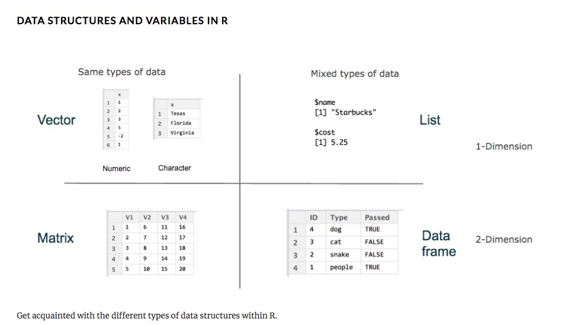
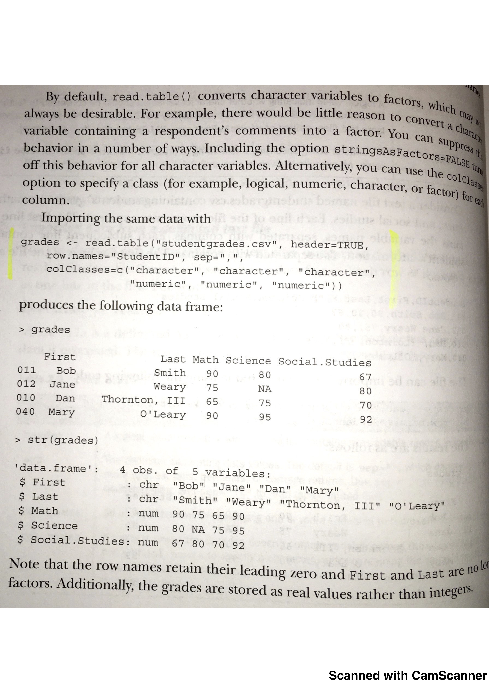
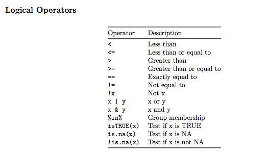
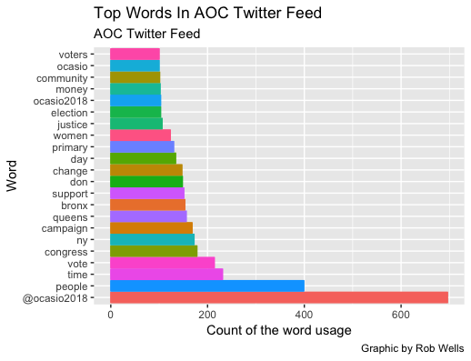

#Inside Twitter: Data Analysis for Journalists
##Jour 405v, Jour 5003, Spring 2019


###Rob Wells, Ph.D. 
####University of Arkansas
####School of Journalism and Strategic Media  

> rswells@uark.edu   

> @rwells1961  


**Course Goal:** Students will learn the latest data journalism techniques that drive modern newsrooms and public relations / advertising offices. The class will extract and analyze Twitter data with the goal of producing an interactive multimedia presentation.

**Course Description:** This course will teach students how to code in programs such as R and SQL and how these powerful tools are used in modern news reporting. Quality reporting in newsrooms requires a solid foundation of data analysis. The data skills taught in this class are in high demand in newsrooms and corporations.


>

**Required Text:**
Machlis, Sharon. Practical R for Mass Communications and Journalism. Chapman & Hall/CRC The R Series. 2018. ISBN 9781138726918
https://www.amazon.com/gp/search?keywords=9781138726918

> [Link to several free chapters: "CNTL" + click for a New Tab](http://www.machlis.com/R4Journalists/){target="_blank"}


> [**Syllabus - Jour 405v:**: "CNTL" + click for a New Tab](https://bit.ly/2SPilDr){target="_blank"}


> [**Syllabus - Jour 5003**: "CNTL" + click for a New Tab](https://bit.ly/2S3tPP2){target="_blank"}   

> [**Course GitHub site**: "CNTL" + click for a New Tab](https://github.com/profrobwells/Data-Analysis-Class-Jour-405v-5003){target="_blank"}   


##Upon completion of this course, you will celebrate like this:   


**--**


--------------------------------------------------------------------

#Week #1:Introduction and R Basics

**Agenda:**
--1/14/2019 - Week 1  

--Email to students

--Discuss syllabus

--Intro R and R Studio. Open program.  

Machlis website:  
http://www.machlis.com/R4Journalists/index.html  


--R interface explained: Four main windows

      Script writing, R Markdown, Table Viewer: Upper Left  
      Environment - data loaded in R: Upper Right  
      Console - write commands in R: Lower Left  
      File Manager and Html table viewer: Bottom Right
      
  
https://docs.google.com/presentation/d/1O0eFLypJLP-PAC63Ghq2QURAnhFo6Dxc7nGt4y_l90s/edit#slide=id.g1bc441664e_0_10

--Show basic R skills.

--Loading software. 
   Tidyverse  
   Rio
   
--Conventions in coding.

--How many rows?
nrow(yourdataset)

--How many columns?
ncol(yourdataset)

--What is in the first five rows?
head(yourdataset)

--rename columns. create columns

--------------------------------------------------------------------   
##Wednesday, Jan. 16  

--Misc  

      Class intros  
      Book - Amazon  
      Installation issues on laptops?  
      Twitter feeds: @rstudiotips
      

 
--Run demos from Ch. 3  


--Show Collins results  


--Twitter analysis of Trump Tweets http://varianceexplained.org/r/trump-tweets/   


--Ch 1 & 2 of Machlis: Key Points   

    Reproducible research 
    Repetitive tasks in modern newsrooms.  Employment reports, crime stats, budgets
    Variables - an R object
    Assignment operator <-
    Case sensitive
    Vector: A vector can only have one type of data - all integers, all strings
    Dataframe - like a spreadsheet
    Save files - Don’t save workspace: because all of your variables will be stored and re-loaded the next time you launch RStudio. It’s too     easy to forget about previously stored variables that can interfere with later work,

    
--Software packages: tidyverse, rio, pacman


--Software: How to get details and help

    help(package="dplyr")
    browseVignettes("NameOfPackage”)
    help("NameOfFunction”)
    ??median

--Data Types and R   

Machlis: 2.4.2 Data types you’re likely to use often
  



--EXERCISES: Excel vs R  
--Load tutorial: Introduction-to-R-January-2019.R
> [**Download this file and open it in R Studio**](https://bit.ly/2MjSSfJ){target="_blank"}  

--Left click on the page, remove .txt extension, save as all files 

--Keyboard Shortcuts
    
    Tab - Autocomplete
    Control (or Command) + UP arrow - last lines run
    Control (or Command) + Enter - Runs current or selected lines of code 
    in the top left box of RStudio
    Shift + Control (or Command) +P - Reruns previous region code
    
**Notes:**
--Basic descriptive statistics
—Review ComputerWorld’s Beginner’s Guide To R
--Stack Overflow at stackoverflow.com


**Reading:**  

--Machlis. Chapter 1 & 2. 

--Beginner's guide to R:
https://www.computerworld.com/article/2497143/business-intelligence/business-intelligence-beginner-s-guide-to-r-introduction.html

--Twitter analysis of Trump Tweets
http://varianceexplained.org/r/trump-tweets/

--Review another R tutorial
https://docs.google.com/presentation/d/1zICxR7qDM3RQ2Nxi5CqHlM3H8I7qoVkNtqcNcnbbDCw/edit#slide=id.p

  

**Resources:**
RStudio Navigation Tricks You Might’ve Missed
https://rviews.rstudio.com/2016/11/11/easy-tricks-you-mightve-missed/

How Do I?
https://smach.github.io/R4JournalismBook/HowDoI.html

Functions
https://smach.github.io/R4JournalismBook/functions.html

Packages
https://smach.github.io/R4JournalismBook/packages.html
**--**  


--------------------------------------------------------------------
#Week #2 - 1/21/2019: File management  

##Wednesday, Jan. 23 Agenda

--Next week Quiz on Basic R functions described so far in exercises. 

--Readings / Coursework for MA Students
> [**Sign up for this free class from Nick Diakopolous**](https://twitter.com/utknightcenter/status/1085657878361305100){target="_blank"}   

    --Workload TBD - I will assign select videos and readings from this class. 

**Exercise**

--Load tutorial: Introduction-to-R-January-2019.R
> [**Download this file and open it in R Studio**](https://bit.ly/2MjSSfJ){target="_blank"}  

--Based on this tutorial, perform this exercise:  

    1. Percentage change from 2010-2017.
    2. Produce a table with 5 counties with most growth. 
    3. Produce table with 5 counties with greatest population loss
    4. Graph the top 5 and bottom 5
    5. Filter just Benton County’s population for 2015
    6. And if you finish that, bring up AOC.csv. How many rows? How many columns?
    7. AOC.csv filter the text field for “Pelosi” or “Trump” or “New Deal"


**Reading:**

--Machlis. Chapter 3 & 4.  

--Study Twitter meta data  
https://developer.twitter.com/en/docs/tweets/data-dictionary/overview/tweet-object.html

--Look at this example: Ocasio.csv  (in data folder of course page)

--Cohen, "Numbers in the Newsroom," Common Mistakes.    

--String data manipulation
https://dereksonderegger.github.io/570L/13-string-manipulation.html

--Follow StoryBench, Northeastern Univ.
https://twitter.com/storybench

**Resources**  
--Use R instead of Excel: Andrew Ba Tran  
    Excellent Tutorial Spelling out Excel and Comparable Commands in R  
https://trendct.org/2015/06/12/r-for-beginners-how-to-transition-from-excel-to-r/  
Basic data work- head to http://bit.ly/excel_and_r 


--All Cheat Sheets
https://www.rstudio.com/resources/cheatsheets/

**--**  


--------------------------------------------------------------------

#Week #3- 1/28/2019: R Twitter Data. Data Types. Scripts

##Monday, Jan. 28   

--**Quiz on Basic R functions for Wednesday**
The quiz will be multiple choice and will cover basic file management and data types, stuff I mentioned the first two weeks.


--Describe Assignment #1 due Feb. 6: Managing Data / Static Graphic 

--Announcements  

      Blackboard site has web links for course
      
     
> [ProPublica Sponsoring Students for Conferences](https://www.propublica.org/article/propublica-wants-to-pay-for-students-to-attend-a-journalism-conference-in-2019){target="_blank"}  
     
> [Apply for Scholarships: Deadline Feb. 15](https://fulbright.uark.edu/departments/journalism/resources/scholarships.php){target="_blank"}       

     
> [Special Certification in Crime Data Analysis](https://github.com/profrobwells/Data-Analysis-Class-Jour-405v-5003/blob/master/Images/RTMDx_Flyer_Spring2019.pdf){target="_blank"}   


**Agenda**

--Continue with week #2 tutorial

--**The course GitHub Page**
> [**Here it is**](https://github.com/profrobwells/Data-Analysis-Class-Jour-405v-5003){target="_blank"}  

--See Data folder  

    Click AOC.csv   
    "View raw"   
    Cntl + click (or right click) - Save As - AOC.csv   

**Exercise**    

--Loading Data from U.S. Census & Student Loans    
--Load tutorial: Downloading Data 12-24-18.R     


> [**Download this file and open it in R Studio**](https://bit.ly/2HpApQ7){target="_blank"} 

--Alternate download option: Use read.table() works for importing data:      




--**Loading and basic file management**

    Bringing in data
    Data Frames
    Extracting interesting details
    Cleaning the data
    Reshaping the format
    Manipulating the data
    Exporting  
    Add a column with a math conversion  


--**Ch 3 & 4 of Machlis: Key Points**

    Ch 3 Exercises:
    Stock chart exercise used quantmod is a library for financial analysis. 
    Median Income for a City
    Loading packages
    
    Ch 4 Importing Data
    How read.table() works for importing data:      
    Loading data
    Manipulating data: dplyr -  stringr
    Data Management: mutate rename bind_rows 


--Math 
--Summary Statistics

  summary(Crime)

  mean(x) Calculate the mean, or average, for variable x.
  median(x) Calculate the median.
  max(x) Find the maximum value.
  min(x) Find the minimum value.
  sum(x) Add all the values together.
  n() Count the number of records. Here there isn’t a variable in the brackets of the function, because the number of records   applies to all variables.
  n_distinct(x) Count the number of unique values in variable x.
  
--Using a function for an equation  
  percent_change <- function(first_number, second_number) {
  pc <- (second_number-first_number)/first_number*100
  return(pc)
}

  percent_change(100,150)
  [1] 50
  
  This is what’s happening in the code above:
  * percent_change is the name of the function, and assigned to it is the function function()
  * Two variables are necessary to be passed to this function, first_number and second_number
  * A new object pc is created using some math calculating percent change from the two variables passed to it
  * the function return() assigns the result of the math to percent_change from the first line
  Build enough functions and you can save them as your own package.

--Set up column for math calculations
  Example: Total column shows winter snowfall in inches. To add a column    showing totals in Meters, you can use this format:   
  .snowdata$Meters <- snowdata$Total * 0.0254
  
--**Export data**    
  Write Export output this file to a CSV or Excel  write.csv or write.excel
  write.csv(AR2016_SMALL,"AR2016_SMALL.csv") 
  
**Reading** 
Machlis Chs. 5 & 6. 

Seth C. Lewis, et al. “Big Data and Journalism: Epistemology, Expertise, Economics and Ethics,” Digital Journalism, 2015

**Resources:**

--For analysis library(dplyr)  

--------------------------------------------------------------------

##Wednesday, Jan. 30   

--**Quiz on Basic R functions**    

--Data Visualization Intro   
--Load tutorial: Basic Data Visualization 12-26-18.R       

> [**Download this file and open it in R Studio**](https://bit.ly/2RlQtSE){target="_blank"} 

--Visualizing data
  
    ggplot2 - charts and maps
    Export Static chart 

**Exercises**

Basic Data Visualization 12-26-18.R  

--------------------------------------------------------------------   

**Questions on First Assignment**   

--Here is a good question that came in today about the first assignment.    

**Question**:     
``"What the hell? I converted population to numeric and the calculations come out as NA values!
This is driving me insane! What is going on?"

**Answer**:   
One of the obnoxious things about R is it considers commas as text. So it will show 720 as a number but 2,810 as not a number for calculations because it has a friggin comma.   

**Never fear.** There is a solution. Run the find and replace function, called gsub   

Crimedata$Population <- gsub(",", "", Crimedata$Population)   

Translation:   
Crimedata$Population   
-- is the population column in your crime dataset     
gsub(",", "",  
finds a comma and replaces it with nothing.  --    
and it found the comma in the column Crimedata$Population)
and the <- dumps the results back into the Crimedata$Population  column.

Fancy!   

**Question**:
"How do I get rid of the last row that only has text in the table that I just imported?"   

**Answer**:
Get rid of row using base R commands   
Crimedata <- Crimedata[-c(187), ]    

Translation:     
Crimedata[-c(187), ]    looks for row #187, which has this garbage text, and gives it the big minus sign, which eliminates it.    
Crimedata <-  dumps this slimmed down table back into your table and so you are good to go.   


**--**  


--------------------------------------------------------------------

#Week #4 - 2/4/2019: Using R to build basic graphs and charts  

-----------------

##Monday, Feb. 4 
**Agenda** 

--**Assignment #1 due Feb. 6: Managing Data / Static Graphic**

--GGplot   
--Work with sample Twitter data    
--Conventions in coding      
 
--Visualizing data
  
    ggplot2 - charts and maps
    htmlwidgets - web visualization interactives
    plotly - exporting charts online
    Chart

**Exercises**
--Continue with Basic Data Visualization Exercise questions    

> [**Start at Line 112**](https://bit.ly/2RlQtSE){target="_blank"} 

--Answer to Monday's in-class exercise
https://bit.ly/2RG6VNy


--**GGPLOT**
--A handy explanation of ggplot and its components   


If you’re using ggplot: plus it!
For everything else: pipe it!

 geom_point() 
 geom_bar()
 geom_boxplot() 
 

--**DPLYR**   


--Dplyr Presentation 

Five basic verbs • filter() • select() • arrange() • mutate() • summarize() plus group_by()
   


  
--Pipes - a Much-Used Command to Link Filters, Functions

    pipe %>%
    CMD +  Shift + M   
    
--Presentation from Bob Rudis on Writing Readable Code with Pipes, delivered at the rstudio::conf 2017.    

https://www.rstudio.com/resources/videos/writing-readable-code-with-pipes/   

Pipes as a way of chaining commands.   
object %>% operation() —> result   


--Key Concepts - Moving Forward:    

    Dplyr: Filters, Grouping, Sorting, pipes %>%  
    Pipe shortcut = CMD + SHIFT + M
    Basic data visualization  
    Tidyverse 
  
**Notes**   
--How Do I?
https://smach.github.io/R4JournalismBook/HowDoI.html

**Resources**  
Basic Charts in R  
https://www.youtube.com/watch?v=1EUJ0tsVsUA&t=12s

**Reading**  
    
    Machlis Chs. 7 & 8.    
    
    Transforming and Analyzing Data dplyr.pdf, Andrew Ba Tran, Washington Post
    
    Charts_with_ggplot by Andrew Ba Tran,
    Washington Post

**--**  

-----------------

##Wednesday, Feb. 6

--Note: Dr. Wells will be late - 10 a.m. - due to data mining presentation in the library       
--Please begin class by working on this exercise: https://bit.ly/2Sqn1j1


--Discuss Twitter Metadata     
--Work with sample Twitter data    
https://developer.twitter.com/en/docs/tweets/data-dictionary/overview/user-object   


--GGplot Video from Andrew Ba Tran  
https://www.youtube.com/watch?v=Sx7d7eGRSj0&t=9s


**Exercises**    
--AOC Twitter feed   
https://bit.ly/2Sqn1j1        

--Graphing in GGPlot   
https://bit.ly/2Gqjfj4   


--Multiple variable in a graph
--Geom_Line, Geom_point, Geom_bar
--How to alter the colors in a chart.


**Notes** 

--Data Wrangling-Text Mining in Twitter. 
    
    See entire scraping sequence. Extract from Twitter.

**Additional Exercises**  
--Ch. 3.8 Run a remote script to make an interactive map   
--Median Income For City.R    
--Work with sample Twitter data     


--**Other Topics**   
--Setting up an R Workflow

 


--------------------------------------------------------------------


#Week #5 - 2/11/19: Dplyr - Using R to build basic graphs and charts  

##Monday, Feb. 11   

--Review Assignment #1   
Assignment1_KEY_StaticGraphic_2_9.R    

--Dplyr bootcamp. 

    See this exercise: 
    DPLYR_bootcamp_Feb_9  

    Dplyr bootcamp, #2. 
    Dplyr_Tutorial_Tran 
    Dplyr - Andrew Ba  Tran - pipes-dplyr.pdf
    

**Homework!**   
--Hand in your Dplyr Cheat Sheets on Blackboard by 11:59 pm Monday.   
--Did I say this was Dplyr bootcamp?   


**Reading:**  
Machlis Chs. 9 & 10 

Albert Cairo, "The Functional Art," Principles of Data Visualization.   

----------------- 

##Wednesday, Feb. 13

--Finish last question on DPLYR_bootcamp_Feb_9 
    
    6: Calculate a violate crime rate per 1,000 students. 
    Create a table selecting campuses, enrollment and crime rates 
    just for the top 5 crime rates

--Andrew Ba Tran dplyr class lesson    


**Exercises**   

--Andrew Ba Tran dplyr class lesson   

    The repo for this class is on Github, but can be easily downloaded to your desktop with the following commands:    

    install.packages("usethis")    
    usethis::use_course("https://github.com/r-journalism/learn-chapter-3/archive/master.zip")    

    --Before running the command, make sure the script is in the working directory folder and that the SHR76_16.sav.zip file is in the data sub folder.   
    --For example, on my computer, the import_murders.R script is in the dplyr folder and SHR76_16.sav.zip file is in the dplyr/data folder.


--And if this *blows up*, we have a backup: Return to dplyr bootcamp, graphing exercises.

--Themes for data viz library(ggthemes) 


**Homework**    
    
    —Finish Andrew Ba Tran dplyr tutorial.   
    —Bring questions to class   
    -Using this data, produce two dplyr queries that investigate the murders dataset for Arkansas.   
    -In class we looked at black and white victims and unsolved murders. Find other queries that would        yield newsworthy material.  
    --Bring questions and your queries to class on Monday. I will call on you to discuss.
    
    


**--**  


--------------------------------------------------------------------

#Week #6 - 2/18/18: Twitter Text   


##Monday Feb. 18  

**Agenda**  

--Analyzing Tweets from public officials: Dataset AOC   

--Study Twitter meta data  
https://twittercommunity.com/
https://developer.twitter.com/en/docs

--Register as Twitter Developer
https://developer.twitter.com/en/account/get-started

--Extracting Text from Twitter 

--Lubridate

**Homework**    
    
    —Finish Andrew Ba Tran dplyr tutorial.   
    —Bring questions to class   
    -Using this data, produce two dplyr queries that investigate the murders dataset for Arkansas.   
    -In class we looked at black and white victims and unsolved murders. Find other queries that would yield newsworthy material.  
    --Bring questions and your queries to class on Monday. I will call on you to discuss.

**Assignment #2 Details**
    
    Visualization of Twitter data.  Due Feb 27, 11:59 p.m.   
    Students will produce publication-ready graphics from Twitter data. 
    Data dictionary required
    
    Details:
    With the assigned dataset, TK TK, students will produce the following tables:
    --Most common words used in Twitter text field
    --Most common hashtags
    --A chart of the volume of Twitter messages by date
    Based on this information, write a 300-500 word report, following AP style, that describes potential newsworthy trends in this Twitter feed and insights from your analysis.

    By 11:59 pm., you will submit the following on Blackboard:  
    3 charts in .jpeg format: 1) Common words 2) Common hashtags 3) Date trend chart
    One Word document with your findings, 300-500 words. Append at the end a brief data dictionary describing the Twitter data fields you used in the assignment.
    An R script with the coding that shows how you loaded and cleaned the data and produced the charts

**Exercises**

    Extracting Text Strings from Twitter
    https://bit.ly/2X5V9jL
    
    What we will produce
   
    
    

##Wednesday Feb. 20  

  --Using Lubridate
  


**Reading:**  
Machlis Chs. 11 & 12   

Twitter metadata  
https://twittercommunity.com/
https://developer.twitter.com/en/docs

For working with dates library(lubridate)   

Dealing-with-dates.pdf by Andrew Ba Tran  

        https://github.com/profrobwells/Data-Analysis-Class-Jour-405v-5003/blob/master/Readings/dealing-with-dates.pdf
        


**--**  


--------------------------------------------------------------------

#Week #7: GitHub

**Agenda**
--2/25/2019 - Week 7  

--**Due Feb 27: Assignment #2. Visualization of Twitter data**


--Create a GitHub account.
https://github.com/

--Follow this tutorial
https://guides.github.com/activities/hello-world/


This class is intended to teach you modern workflow techniques for coding. A centerpiece of that workflow is GitHub. This is a website with a system that allows you to collaborate with other programmers on coding projects. It manages versions of software code and is a very popular with the tech elite. 

Your GitHub account, which is public, represents an important professional image. Prospective employers and collaborators will look at your GitHub account.

--Andrew Ba Tran Tutorials on GitHub
  Git and Github Pages
http://learn.r-journalism.com/en/git/

  Installing Git
https://journalismcourses.org/courses/RC0818/installing_git.pdf

  GIT
https://journalismcourses.org/courses/RC0818/git.pdf

  Connecting to Github
https://journalismcourses.org/courses/RC0818/github.pdf
http://learn.r-journalism.com/en/git/github/github/

  Best Practices for Github
http://learn.r-journalism.com/en/git/github_pages/github-pages/

--Loading and basic file management 

    Commit  
    Branch  
    Pull Request  
    Fork  
  
  
**Resources on GitHub**  

--GitHub flow   
https://guides.github.com/introduction/flow/

--GitHub Guides  
https://guides.github.com/

--Another GitHub guide  
https://andrewbtran.github.io/NICAR/2018/workflow/docs/03-integrating_github.html  

**Reading** 
Machlis Chs. 13 & 14.

**Resources:**


**Exercises**
Installing Git for a Mac - Andrew Ba Tran


    Pair up.  
    Team 1 takes this code. Make changes.    
    Team 2 forks the code. Makes changes.  
    Pull & Commit  


--Setting up an R Workflow
http://learn.r-journalism.com/en/publishing/workflow/r-projects/

**--**  


--------------------------------------------------------------------

#Week #8: R Markdown 

**Agenda**
--3/4/2019 - Week 8  

--**Quiz on GitHub** 
--R Markdown 

--R Markdown, Desktop Publishing
  --Andrew Ba Tran - Week 5 Publishing
http://learn.r-journalism.com/en/publishing/
  --R Markdown
http://learn.r-journalism.com/en/publishing/rmarkdown/rmarkdown/
  --More R Markdown
http://learn.r-journalism.com/en/publishing/more_rmarkdown/more-rmarkdown/

--Rendering html as an output in GitHub  
https://rmarkdown.rstudio.com/lesson-9.html
https://github.com/rstudio/cheatsheets/raw/master/rmarkdown-2.0.pdf

--R Markdown Formatting  
Sizing images:  <.img src="drawing.jpg" alt="drawing" width="200"/>  
  (Note: Remove the period before "img")
https://rpubs.com/RatherBit/90926

--Terminology

    Render  
    Html  
    Markdown  

**Notes**
R Markdown

This is an R Markdown document. Markdown is a simple formatting syntax for authoring HTML, PDF, and MS Word documents. For more details on using R Markdown see <http://rmarkdown.rstudio.com>.

When you click the **Knit** button a document will be generated that includes both content as well as the output of any embedded R code chunks within the document. You can embed an R code chunk like this:

```{r cars}
summary(cars)
```

Including Plots

You can also embed plots, for example:

```{r pressure, echo=FALSE}
plot(pressure)
```

Note that the `echo = FALSE` parameter was added to the code chunk to prevent printing of the R code that generated the plot.


**Reading**   
Machlis Chs. 15 & 16


--Read Kavanaugh text mining story: Text analysis of Brett Kavanaugh’s opinion.  
http://www.storybench.org/bringing-textual-analysis-tools-to-judge-brett-kavanaughs-latest-opinion/

Samantha Sunne, “The Challenges and Possible Pitfalls of Data Journalism, and How You Can Avoid Them,” American Press Institute, 2016


**Resources:**
--Create R Markdown document, export to PDF, HTML  

**Exercises**


Line breaks: Use HTML tags. Adding <br> will give a single line break --     option for when two-space indentation is ignored. 

**--**  


--------------------------------------------------------------------

#Week #9: Text Mining 

**Agenda**
--3/11/2019 - Week 9  

--**Extra Grad Assignment** - Scraping Twitter. Due March 13.

--Basic text mining techniques  
--Lubridate  


**Reading** 
Machlis Chs. 17 & 18

**Resources:**
*Resources*  
Grammar of Graphics
http://vita.had.co.nz/papers/layered-grammar.html


**Notes**    

    --The pie chart focuses the reader on large percentages, and encourages the reader to think of the total
    --The stacked bar plot provides the same information, but makes it easier to accurately determine at a glance how large each group is out of the whole.
    --This bar chart splits the categories horizontally, and draws attention to how the family members are ordered. It encourages the reader to think about the distribution rather than disconnected categories, and gives a better sense of sense of scale.


--Joining Dataframes in R  
https://www.youtube.com/watch?v=gLg4D9bMIyc&t=13s

--Data Wrangling
http://learn.r-journalism.com/en/wrangling/

http://learn.r-journalism.com/en/wrangling/dplyr/dplyr/

https://github.com/r-journalism/learn-chapter-3/blob/master/dplyr/pipes-dplyr.R


**Exercises**
Data Wrangling-Text Mining in Twitter.R

**--**  


-------------------------------------------------------------------- 

#SPRING BREAK -- March 18-22 -- MAKE GOOD LIFE CHOICES

**. **

--------------------------------------------------------------------

#Week #10: Mapping in R


**Agenda**
--3/25/2019 - Week 10  

--**Due March 27: Assignment #3. Interactive Map**

--Produce a basic interactive map in R, post on WordPress

--Andrew Ba Tran - Week 4 Mapping
http://learn.r-journalism.com/en/mapping/

**Reading** 
“Connecting the Dots” by Jacob Harris (2015) and discuss how people should or should not be represented through news visualizations.

What is code? http://www.bloomberg.com/graphics/2015-paul-ford-what-is-code/

--Graphing GGplot 12-28.R
  Exercises from Machlis Ch. 9. Facets

Ch 3 Exercises:
    Stock chart exercise used quantmod is a library for financial analysis. 
    dygraphs creates *interactive Web graphics* of data over time.


**Resources:**
--Visual Narrative Tricks by Albert Cairo
https://www.youtube.com/watch?v=TSGaueL4Ggk

Spatial data
  maptools - work with shapefiles


**Exercises**
--Maps in R 12-28-18.R

**--**  


--------------------------------------------------------------------

#Week #11: Mapping in R 

**Agenda**
--4/1/2019 - Week 11  
--Produce a basic interactive map in R, post on WordPress

--You will make this in the class  
  


**Reading** 
Bad data visualizations. Data Translation. 

The Journalist as Programmer: A Case Study of The New York Times Interactive News Technology Department http://isoj.org/wp-content/uploads/2016/10/ISOJ_Journal_V2_N1_2012_Spring.pdf

**Resources:**

**Exercises**
--Maps Spatial Analysis Tutorial.R
**--**  


--------------------------------------------------------------------

#Week #12: Web Scraping in R

**Agenda**
--4/8/2019 - Week 12  


--Web Scraping in R  
--Application Programming Interface - API  
Twitter historical API
https://developer.twitter.com/en/docs/tutorials/choosing-historical-api

--See 4.8 in Machlis:
‘Scrape’ data from Web pages with the rvest package and SelectorGadget browser extension or JavaScript bookmarklet. SelectorGadget helps you discover the CSS elements of data you want to copy that are on an HTML page; then rvest uses R to find and save that data. This is not a technique for raw beginners, but once you’ve got some R experience under your belt, you may want to come back and re-visit this. I have some instructions and a video on how to do this at http://bit.ly/Rscraping. RStudio has a webinar available on demand as well, at https://www.rstudio.com/resources/webinars/extracting-data-from-the-web-part-2/ .


**Reading** 
Julia Angwin, Terry Parris Jr., Surya Mattu. “Breaking the Black Box: What Facebook Knows About You,” ProPublica, 2016; 

Nicholas Diakopolous, “Algorithmic Accountability,” Digital Journalism, 2014.

APIs - basics
https://medium.com/@LewisMenelaws/a-beginners-guide-to-web-apis-and-how-they-will-help-you-23923a0da450

A gentle introduction to APIs for data journalists
https://trendct.org/2016/12/29/fetching-airport-delays-with-python-a-gentle-guide-to-apis-for-journalists/

**MA Students**
--Sign up for a Census API key: https://api.census.gov/data/key_signup.html

**Resources:**

**Exercises**
--MA Students, Census API exercise
**--**  


--------------------------------------------------------------------

#Week #13:  Web Scraping in R

**Agenda**
--4/15/2019 - Week 13  
-- Web Scraping in R

**Reading** 
--Twitter analysis of Trump Tweets
http://varianceexplained.org/r/trump-tweets/

Different types of Twitter APIs
https://developer.twitter.com/en/products/products-overview


Amy Webb future of journalism trends
https://futuretodayinstitute.wetransfer.com/downloads/0e84e883e140bafe9a3436a6464032be20171003123607/ecda17
**Resources:**

**Exercises**
Continue with Week 12 materials

**--**  


--------------------------------------------------------------------

#Week #14: Sentiment Analysis - Final Project

**Agenda**
--4/22/2019 - Week 14  

--Sentiment Analysis

**Reading**
--Sentiment analysis
http://saifmohammad.com/WebPages/NRC-Emotion-Lexicon.htm  

--Saif Mohammad research on sentiment analysis  
http://saifmohammad.com/index.html

**Resources:**

**Exercises**

Collins sentiment analysis 10-13-18.R

**--**  


--------------------------------------------------------------------


#Week #15: Wrap Up


**Agenda**
--4/29/2019 - Week 15  

--**Assignment #4 Final Project: Interactive Data Visualization**


**--**  


--------------------------------------------------------------------
#RESOURCES  

## Download R and RStudio

This program is loaded on all of the computers in Kimpel 146. You can load it on your laptop as well. It is not large and doesn't tax the memory a lot. R runs on Windows, Mac and Linux, but this course uses the Mac version. If you use Windows on your personal laptop, the instructor is not responsible for any variations in the lessons and instructions.

First, download the most recent version of R at https://www.r-project.org/, . 
Look for the link to download R. Click that download option and you should be taken to CRAN, the Comprehensive R Archive Network, and a list of CRAN servers, called mirrors, around the world. Pick a server and choose the precompiled binary distribution for your operating system. Once the file finishes downloading, install it like any other software program – run the .exe for Windows or .pkg for Mac.

Accept all of the default settings for Mac.

Second, install RStudio, an excellent user interface that helps you manage and create R code. Download the open source edition of R Studio desktop and follow the prompts to install it. http://www.rstudio.com/products/rstudio/download/

More information:
http://www.machlis.com/R4Journalists/download-r-and-rstudio.html
